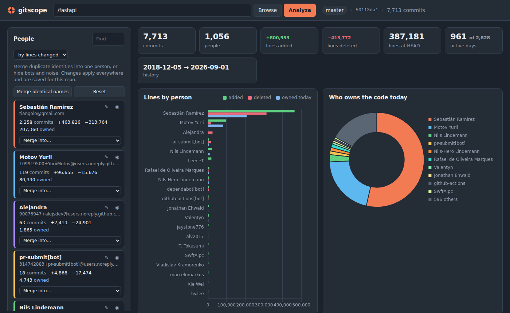

# gitscope

A local dashboard for poking at a git repository: who wrote what, how the codebase grew, when people commit, which files churn the most. Runs in Docker, opens in a browser, reads repos straight from your disk.

It is meant for you, on your machine. There is no auth and no hardening, so don't expose the port to the internet.



## Quick start

You need Docker Desktop (Windows, macOS) or Docker Engine with the compose plugin (Linux).

```bash
git clone <this repo> gitscope && cd gitscope
cp .env.example .env        # then edit REPOS_ROOT
docker compose up -d --build
```

Open http://localhost:8080.

`REPOS_ROOT` in `.env` is the folder that holds your repositories. It gets mounted read-only into the container, and everything under it is browsable in the UI. Use forward slashes on every OS:

| OS      | example                          |
|---------|----------------------------------|
| Windows | `REPOS_ROOT=C:/Users/simon/code` |
| macOS   | `REPOS_ROOT=/Users/simon/code`   |
| Linux   | `REPOS_ROOT=/home/simon/code`    |

Pointing it at your whole home folder works too, it is just slower to browse.

To stop: `docker compose down`. To also wipe saved merges and the blame cache: `docker compose down -v`.

## Picking a repository

Three ways, all in the browser:

* **Browse**: click Browse, folders that contain `.git` get a `git` badge and an Analyze button.
* **Type a path**: relative to your repos root (`crm-angular`, `clients/rkwk/importer`) or paste the full host path from Explorer / Finder (`C:\Users\simon\code\crm-angular`). Both are mapped onto the mount.
* **Recent list** on the start page, or a bookmarkable URL like `http://localhost:8080/?repo=/crm-angular`.

Only paths inside `REPOS_ROOT` can be analysed. If your repos live in several unrelated places, either point `REPOS_ROOT` at a common parent or add more volume lines in `docker-compose.yml` (e.g. `- "D:/work:/repos/work:ro"`).

## What you get

**People** (left column). One entry per email address. This is where you fix identities:

* *Merge into…* folds one identity into another. Typical cases: your work and private email, `github-actions` vs `github-actions[bot]`, or the `Claude` co-author from Claude Code when you know it was you driving. Merged members are listed under the person with a ✕ to split them off again.
* *Merge identical names* does the obvious merges (same display name, different emails) in one click.
* ◉ / ◌ hides a person from every chart and number (bots, imported history, whoever).
* ✎ renames the displayed name.

All of this is saved per repository in the `gitscope-data` volume, so it survives restarts and applies again next time you open the same repo.

**Options**

* *Count co-authors*: credits every `Co-authored-by:` trailer with the whole commit as well, the way GitHub's contributor graph does. Off by default. Turn it on if you want to see Claude Code (or a pairing partner) as a contributor, then merge or hide as you see fit. A merged pair never double counts.
* *Count merge commits*: merge commits carry no line changes, this only affects commit counts.
* *All branches*: analyse every ref instead of just what HEAD reaches.
* *Ignore paths*: globs like `package-lock.json, dist/, *.min.js, vendor/`. A trailing slash matches that folder anywhere in the tree. Applies to churn, file types, most changed files and ownership.

**Charts and tables**

* Summary: commits, people, lines added / deleted, lines at HEAD, active days, history span.
* Lines by person: added, deleted, and (once computed) lines still owned at HEAD.
* Who owns the code today: runs `git blame -w` on every text file at HEAD, in parallel, in the background with a progress bar. Cached on disk per HEAD sha, so it only reruns after new commits. Files over `BLAME_MAX_LINES` (default 20,000) are skipped so a minified bundle doesn't dominate.
* Activity over time: stacked per person, by week / month / year, commits or lines changed.
* Lines over time: cumulative added minus deleted per person, plus the total.
* When people commit: weekday × hour heatmap in each author's local time.
* File types: lines added or lines owned per extension.
* Most changed files, busiest days, and a searchable commit list filterable by person.

## Notes per OS

**Windows.** Docker Desktop shares drives on demand; if the mount comes up empty, check Settings → Resources → File sharing. Bind mounts from the Windows filesystem are slow for git operations with many files, so ownership on a big repo can take a while. If your repos already live inside WSL, run `docker compose up` from the WSL shell and set `REPOS_ROOT=/home/you/code`, that path is fast.

**macOS.** Nothing special. On the first run Docker may ask for permission to access the folder.

**Linux.** Files in the container are read as root, which is fine for a read-only mount. `git config --system safe.directory '*'` is set in the image so git doesn't refuse mounts owned by your user.

## Running without Docker

Needs Python 3.11+ and git on PATH.

```bash
REPOS_ROOT=$HOME/code ./run-dev.sh
```

On Windows without WSL: `set REPOS_ROOT=C:/Users/simon/code`, then `cd backend && pip install -r requirements.txt && uvicorn app:app --port 8080`.

## How it works

* `backend/gitstats.py` shells out to git. One `git log --numstat` pass per repo gives every commit with author, co-author trailers, timestamp with timezone, and +/- lines per file. Renames like `src/{old => new}/x.py` are resolved to the new path. Binary files count as touched but not as lines.
* The frontend (`frontend/app.js`, vanilla JS + Chart.js, no build step) receives the raw commit list and does all aggregation itself. Merging or hiding people therefore never hits git again.
* Ownership is a background job: text files at HEAD are listed with a single `git diff --numstat <empty tree> HEAD`, then blamed in a thread pool. Result lands in `/data/cache`.
* Identities and the recent list are small JSON files in `/data`. Chart options are remembered in the browser's localStorage per repo.

API, if you want to script against it: `GET /api/browse?path=`, `GET /api/repo?path=`, `GET /api/analyze?path=&all=&ignore=`, `POST|GET /api/ownership?path=`, `GET|PUT /api/identities?path=`. Interactive docs at `/api/docs`.

## Limits worth knowing

* Identity is keyed by email. Two names on one email collapse automatically; one name on two emails needs a merge (or the one-click button).
* "Lines" means lines in git's diff, so a reformatting commit counts like real work. Use ignore patterns to drop lockfiles, generated code and vendored stuff.
* Ownership follows the primary author only; blame has no notion of co-authors.
* Everything is loaded into the browser at once. Repos with ~10k commits load in a few seconds, six-figure commit counts will feel heavy.
* The repos mount is read-only on purpose. gitscope never writes to your repositories.
